# 2020-2-Database-Programming-SNS-Service

2020-2 데이터베이스 프로그래밍 수업에서 jsp, Oracle을 사용하여 만든 SNS 서비스

## 1. 구현 기능

### 1.1 회원가입 기능

### 1.2 로그인 기능

### 1.3 게시글 작성(게시글 작성 시 해시태그 추가)

### 1.4 게시글 수정 및 삭제

### 1.5 댓글 작성

### 1.6 댓글 수정 및 삭제

### 1.7 해시태그로 게시글 검색

## 2. 데이터베이스 모델링

### 2.1 논리적 모델

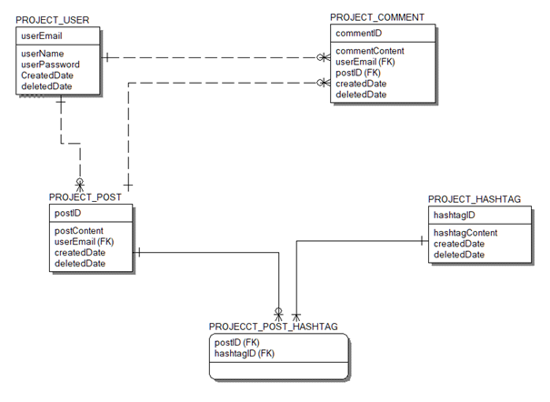

#### 2.1.1 관계 테이블

| 개체1           | 개체2                | 식별/비식별 | 최대 카디널리티 | 최소 카디널리티 |
| --------------- | -------------------- | ----------- | --------------- | --------------- |
| PROJECT_USER    | PROJECT_COMMENT      | 비식별      | 1 : N           | M : O           |
| PROJECT_USER    | PROJECT_POST         | 비식별      | 1 : N           | M : O           |
| PROJECT_POST    | PROJECT_COMMENT      | 비식별      | 1 : N           | M : O           |
| PROJECT_POST    | PROJECT_POST_HASHTAG | 식별        | 1 : N           | M : O           |
| PROJECT_HASHTAG | PROJECT_POST_HASHTAG | 식별        | 1 : N           | M : M           |

#### 2.1.2 테이블 스키마

- PROJECT_USER Table

| 칼럼명       | 타입         | 키형태      | NULL     | 비고            |
| ------------ | ------------ | ----------- | -------- | --------------- |
| userEmail    | varchar2(25) | primary key | NOT NULL |                 |
| userName     | varchar2(10) | No          | NOT NULL |                 |
| userPassword | varchar2(50) | No          | NOT NULL |                 |
| createdDate  | date         | No          | NULL     | Default SYSDATE |
| deletedDate  | date         | No          | NULL     |                 |

- PROJECT_COMMENT Table

| 칼럼명         | 타입         | 키형태      | NULL     | 비고            |
| -------------- | ------------ | ----------- | -------- | --------------- |
| commentID      | number       | primary key | NOT NULL |                 |
| commentContent | varchar2(10) | No          | NOT NULL |                 |
| userEmail      | varchar2(25) | foreign key | NOT NULL |                 |
| postID         | number       | foreign key | NOT NULL |                 |
| createdDate    | date         | No          | NULL     | Default SYSDATE |
| deletedDate    | date         | No          | NULL     |                 |

- PROJECT_POST Table

| 칼럼명      | 타입          | 키형태      | NULL     | 비고            |
| ----------- | ------------- | ----------- | -------- | --------------- |
| postID      | number        | primary key | NOT NULL |                 |
| postContent | varchar2(200) | No          | NOT NULL |                 |
| userEmail   | varchar2(25)  | foreign key | NOT NULL |                 |
| createdDate | date          | No          | NULL     | Default SYSDATE |
| deletedDate | date          | No          | NULL     |                 |

- PROJECT_HASHTAG Table

| 칼럼명         | 타입         | 키형태      | NULL     | 비고            |
| -------------- | ------------ | ----------- | -------- | --------------- |
| hashtagID      | number       | primary key | NOT NULL |                 |
| hashtagContent | varchar2(10) | No          | NOT NULL |                 |
| createdDate    | date         | No          | NULL     | Default SYSDATE |
| deletedDate    | date         | No          | NULL     |                 |

- PROJECT_POST_HASHTAG table

| 칼럼명    | 타입   | 키형태                   | NULL     | 비고 |
| --------- | ------ | ------------------------ | -------- | ---- |
| postID    | number | primary key(foreign key) | NOT NULL |      |
| hashtagID | number | primary key(foreign key) | NOT NULL |      |

### 2.2 물리적 모델

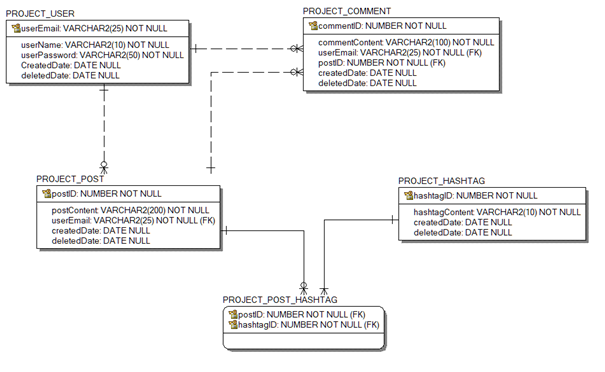

## 3. 구현 결과

### 3.1 메인 페이지

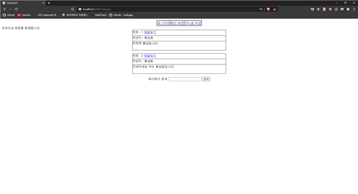

### 3.2 게시글 작성(빈 게시글 경고 trigger)

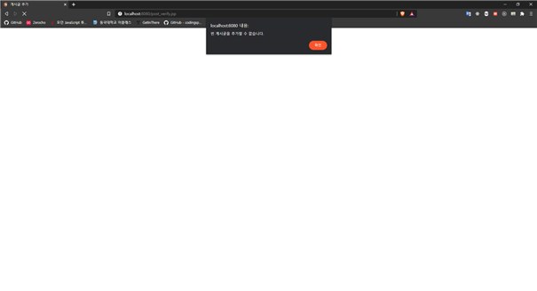

### 3.3 게시글 수정

### 3.4 댓글 확인

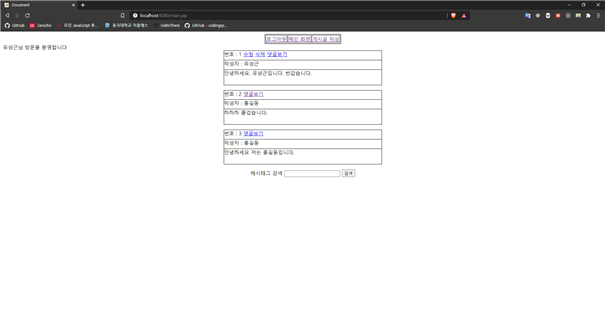
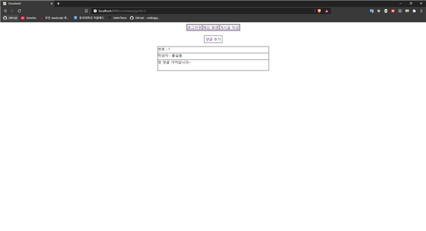

### 3.5 댓글 작성(빈 댓글 경고 trigger)

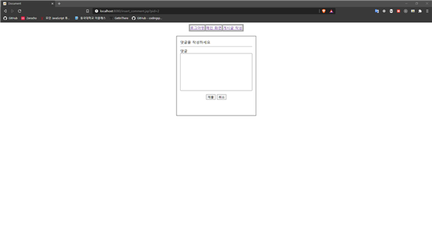
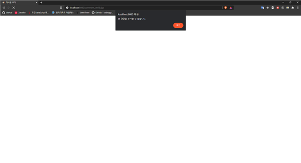

### 3.6 댓글 수정

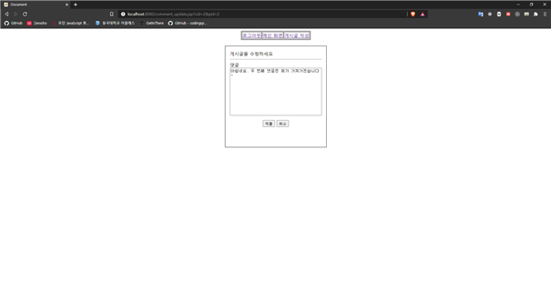

### 3.7 해시태그 작성 및 검색

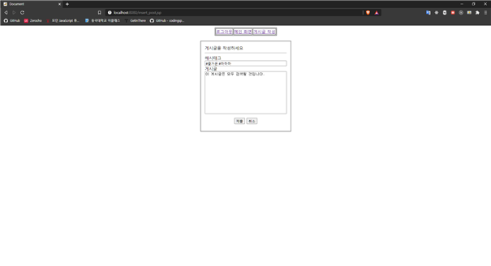

- '즐거운' 해시태그 검색

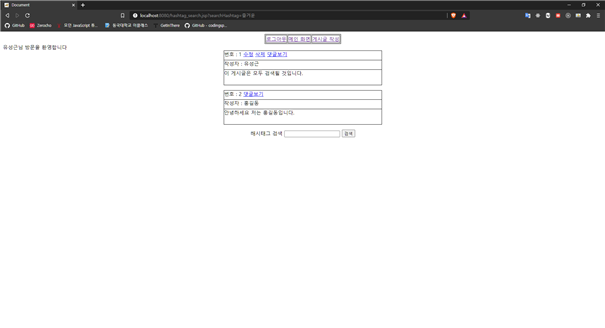

- '하하하' 해시태그 검색

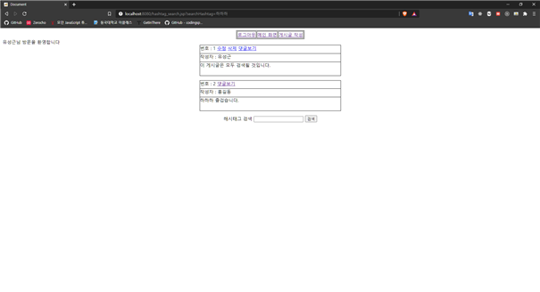
